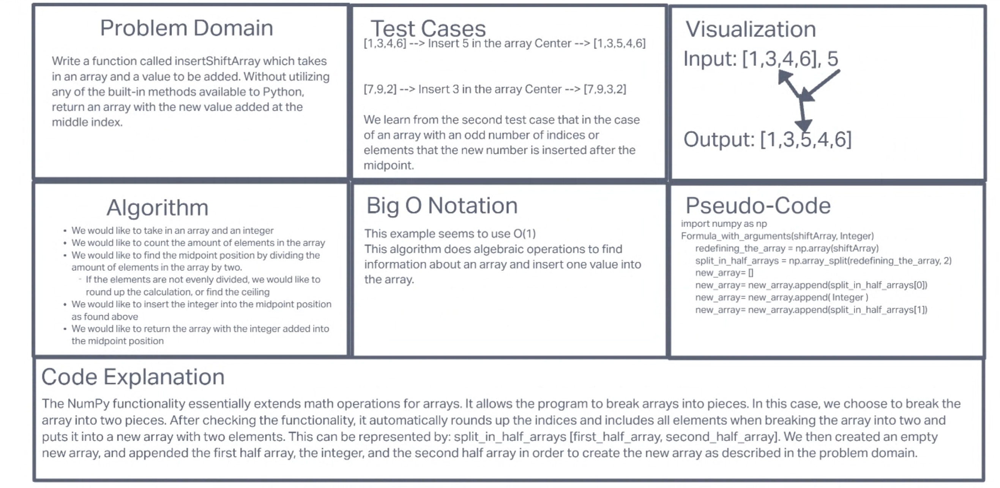

# Insert to Middle of an Array

## Collaborators: Jae Loney, Pedro Perez, Brian Tarte
Write a function called `insertShiftArray` which takes in an array and a value to be added. Without utilizing any of the built-in methods available to your language, return an array with the new value added at the middle index.

## Whiteboard Process

## Approach & Efficiency
We worked in invision and took a mob-programming approach, working through everything together, simultaneously.
