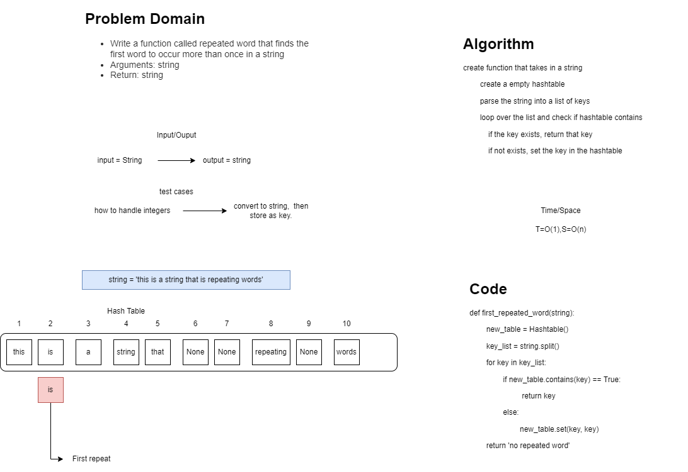

# Challenge Summary
**Find the first repeated word in a book**

## Collaborator: Brendon H.

## Feature Tasks:
 - Write a function called `repeated word` that finds the first word to occur more than once in a string
   - Arguments: string
   - Return: string

## Whiteboard Process

## Approach & Efficiency
 - Space: O(n) because we use a for loop
 - Time: O(1) because it runs one time
## Solution
pytest tests/code_challenges/test_hashable_repeated_word.py
[Link to Code](python/code_challenges/hashtable_repeated_word.py)
