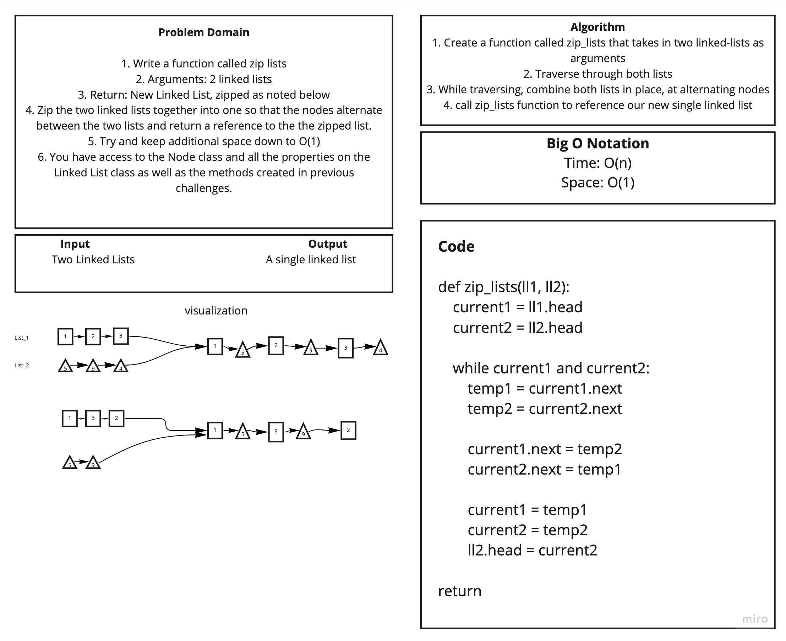

# Code Challenge 08

## Collaborators: Anthony H.
### Zip two linked lists
**Problem Domain:**

#### Write a function called zip lists
- Arguments: 2 linked lists
- Return: New Linked List, zipped as noted below
- Zip the two linked lists together into one so that the nodes alternate between the two lists and return a reference to the the zipped list.
- Try and keep additional space down to O(1)
- You have access to the Node class and all the properties on the Linked List class as well as the methods created in previous challenges.

## Whiteboard Process
We mob-whiteboarded as a team to get through the process togehter, using Miro

Linke to code:
[Zip Lists](linked_list_zip.py)

## Approach & Efficiency
Time = O(n) because we are traversing the linked list
Space = O(1) because we are not adding to the list
