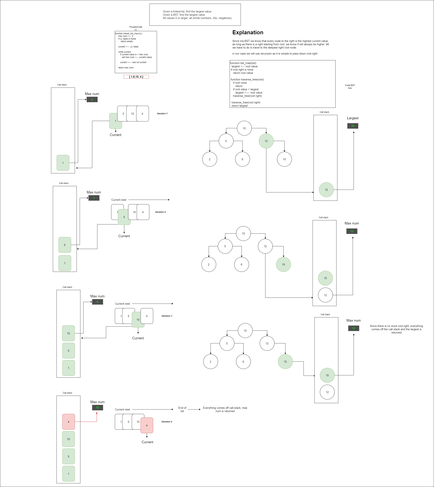

# Code Challenge 28

# Collaborators: Brendon H and Brian T

**Problem Domain:**
1. Given a linked-list, find the largest value.
2. Given a BST, find the largest value
3. All values 0 or larger, all whole numbers. (No -negatives).

### Blog Screen Shot

