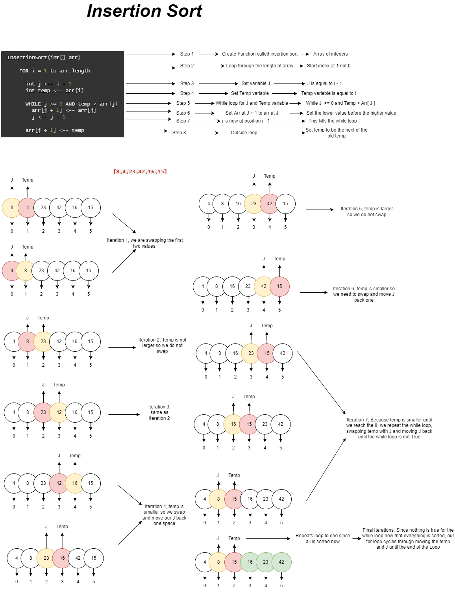

# Code Challenge 26 - Insertion Sort
Review the pseudocode below, then trace the algorithm by stepping through the process with the provided sample array. Document your explanation by creating a blog article that shows the step-by-step output after each iteration through some sort of visual.

## Author: Brian T
## Collaborators: Brendon H

## Whiteboard Process (BLOG)

## Approach & Efficiency
Time: O(n^2) - iterating through an array using a while loop nested in a for loop.
Space: O(1) - because we know how big the loop is

## Solution
pytest tests/code_challenges/test_insertion_sort.py

# Code Challenge 27 - Merge Sort
Review the pseudocode below, then trace the algorithm by stepping through the process with the provided sample array. Document your explanation by creating a blog article that shows the step-by-step output after each iteration through some sort of visual.

## Author: Brian T
## Collaborators: Brendon H

## Whiteboard Process (BLOG)

## Approach & Efficiency
Time: O(n^2) - iterating through an array recursively while calling a helper functions
Space: O(n) - because we are modifying the array in place

## Solution
pytest tests/code_challenges/test_merge_sort.py

