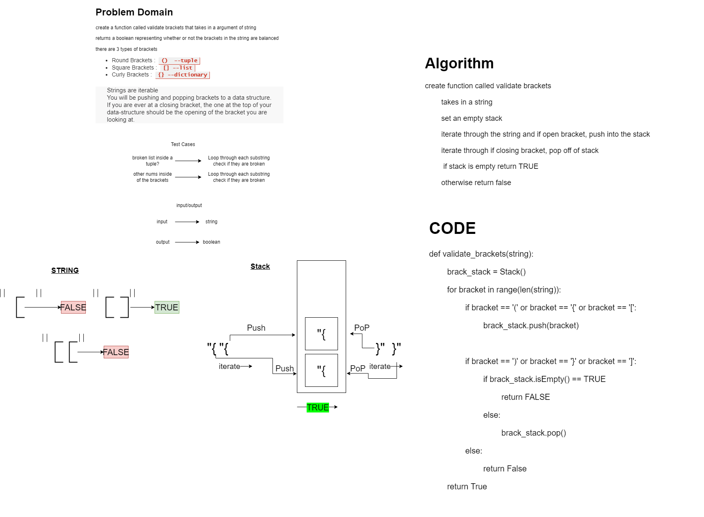

# Code Challenge 13 - Stack & Queue Brackets
## Author: Brian T
## Collaborator(s): Brendon H.

# Challenge Summary
## Feature Tasks
 - Write a function called validate brackets
 - Arguments: string
 - Return: boolean
representing whether or not the brackets in the string are balanced
 - There are 3 types of brackets:

   - Round Brackets : ()
   - Square Brackets : []
   - Curly Brackets : {}

## Whiteboard Process
### We mob-programmed a whiteboard tonight

## Approach & Efficiency
Space: O(n)
Time: O(1)
## Solution
pytest tests/code_challenges/test_stack_queue_brackets.py

## Link to Code
[Brackets](stack_queue_brackets.py)

## Notes:
- We have the half of the tests passing, however, we have work to do with the code to get the remaining tests passing.

