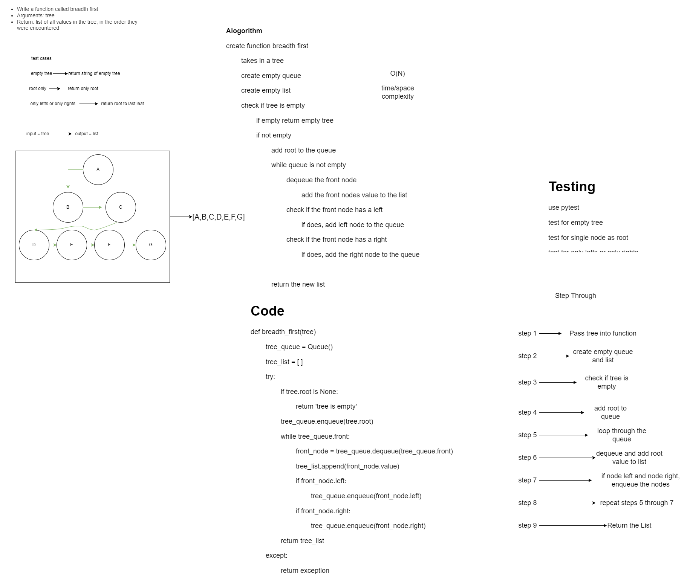

# Code Challenge 17

## Collaborators: Brendon H., Jae L.
### Breadth First
**Problem Domain:**

#### Feature Tasks
- Write a function called breadth first
  - Arguments: tree
  - Return: list of all values in the tree, in the order they were encountered

## Whiteboard Process
We mob-whiteboarded as a team to get through the process together.

Linke to code:
[Breadth_First](tree_breadth_first.py)

## Approach & Efficiency
Time = O(n) because we are traversing the tree
Space = O(n) because we are adding to a list
