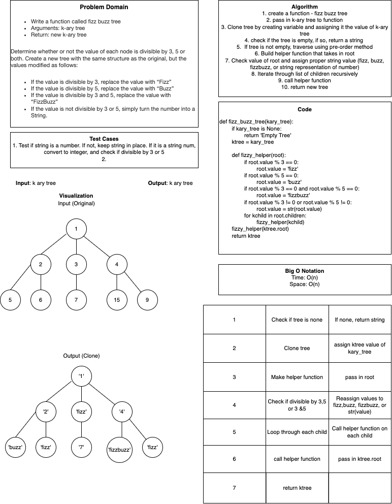

# Code Challenge 18 Tree-Fizz-Buzz
## Author: Brian
## Collaborator: Brendon

# Challenge Summary
## Feature Tasks
1. Write a function called fizz buzz tree
   1. Arguments: k-ary tree
   2. Return: new k-ary tree
   3. Determine whether or not the value of each node is divisible by 3, 5 or both. Create a new tree with the same structure as the original, but the values modified as follows:

      1. If the value is divisible by 3, replace the value with “Fizz”
      2. If the value is divisible by 5, replace the value with “Buzz”
      3. If the value is divisible by 3 and 5, replace the value with “FizzBuzz”
      4. If the value is not divisible by 3 or 5, simply turn the number into a String.

## WhiteBoard

### Link To Code
[Solution](tree_fizz_buzz.py)

### Approach & Efficiency
Time: O(n)
Space: O(n)
### Solution
pytest tests/code_challenges/test_tree_fizz_buzz

