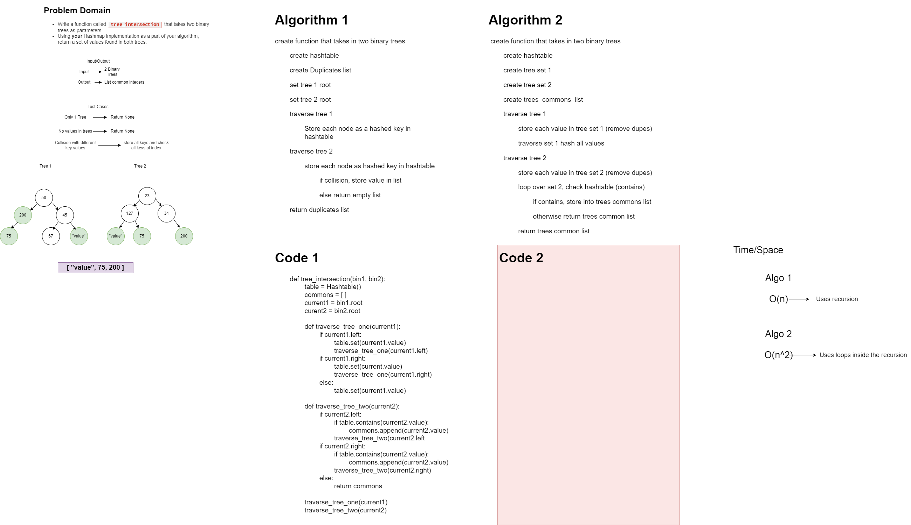

# Challenge Summary
**Find common values in 2 binary trees.**

## Collaborator: Brendon H.

## Feature Tasks:
- Write a function called `tree_intersection` that takes two binary trees as parameters.
- Using your Hashmap implementation as a part of your algorithm, return a set of values found in both trees.

## Whiteboard Process

## Approach & Efficiency
 - Space: O(n) because we use a for loop
 - Time: O(n)

[Link to Code](python/code_challenges/tree_intersection.py)
