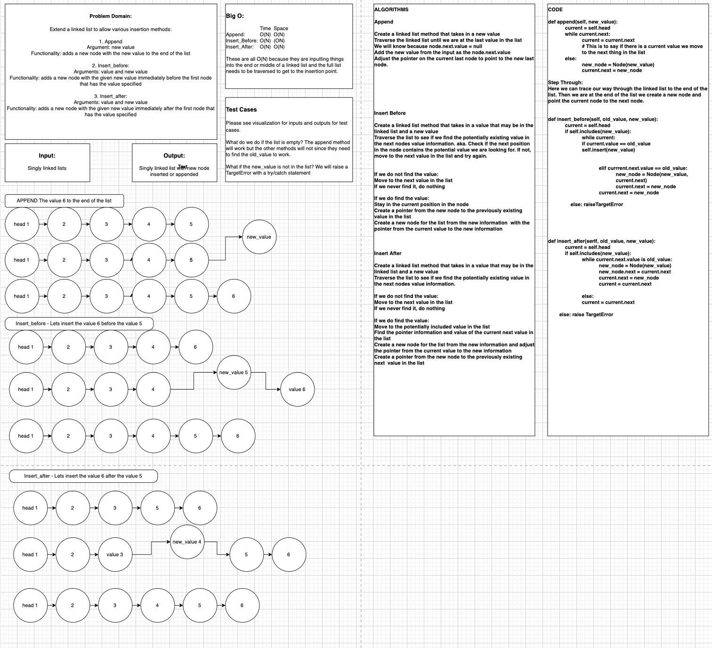

# Linked List Implementation

## Collaborators: Jae Loney & Brian Tarte with assistance from JJ
### Linked List Insertions
Problem Domain:
Extend a linked list to allow various insertion methods:

1. Append
Argument: new value
Functionality: adds a new node with the new value to the end of the list

2. Insert_before:
Arguments: value and new value
Functionality: adds a new node with the given new value immediately before the first node that has the value specified

3. Insert_after:
Arguments: value and new value
Functionality: adds a new node with the given new value immediately after the first node that has the value specified

## Whiteboard Process

## Approach & Efficiency
We mob programmed after whiteboarding!
