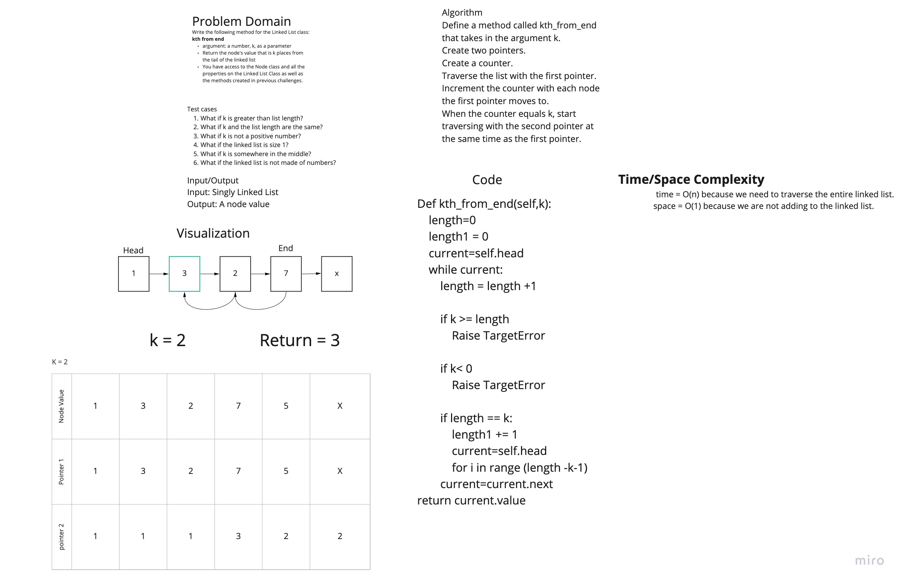

# Code Challenge 07

## Collaborators: Brendon, Anthony H., Marni
### KTh from end
**Problem Domain:**

Write the following method for the Linked List class:

 - kth from end
   - argument: a number, k, as a parameter.
   - Return the node’s value that is k places from the tail of the linked list.
   - You have access to the Node class and all the properties on the Linked List class as well as the methods created in previous challenges.

## Whiteboard Process
We mob-whiteboarded as a team to get through the process togehter, using Miro

## Approach & Efficiency
Time = O(n) because we are traversing the linked list
Space = O(1) because we are not adding to the list
